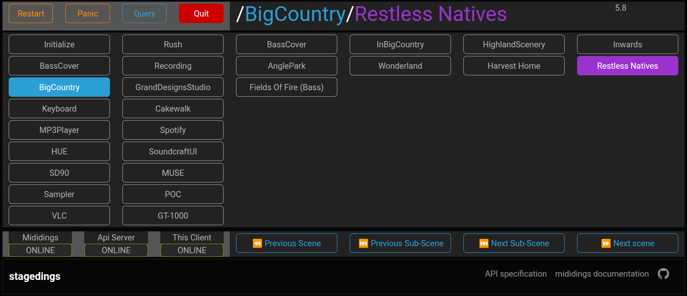

# stagedings
An API to navigate scenes and subscenes that has been configured in a [mididings](https://github.com/mididings/mididings) script

---
### What does stagings allow?
* A web-based interface
  * An alternative of the legacy **`livedings UI`**, which was based on Tkinter 🪓
* A HTTP layer that facilitates control and navigation allowing the abstraction of OSC subcalls
* An OpenAPI specification making possible to generate a client SDK in multiple language with a code  generator like [Kiota](https://github.com/microsoft/kiota) making possible to use the API in .NET, Go, Java, PHP, Python, Ruby and TypeScript.

#### A scene patch dictionary defined in the `run` section of a **mididings** script is required to work correctly
* 🗒️ See the [mididings documentation](https://mididings.github.io/mididings) on the [`run` section here](https://mididings.github.io/mididings/main.html#mididings.run) for how to structure your patch
 
  
## Frontend

### A responsive multiclient, real-time interface for scene/subscene navigation

---
## Features
- Web UI with real-time scene/subscene updates
- FastAPI backend with full REST and WebSocket support
- Multiple clients supported
- Use the mididings OSC interface
- It exposes a **fully compliant OpenAPI spec** for easy generation of SDK clients in any language, enabling flexible remote control of mididings

---

### The frontend allow
* Direct navigation through scenes and subscenes
* Exposes the Restart, Panic, Query and Quit commands

### The backend allow
* Endpoints for direct navigation through scenes and subscenes
* Endpoints to the Restart, Panic, Query and Quit commands

---

## ⚒️ Installation & dependencies
#### On the server running mididings with OSC support
* Clone this repository
* In the stagedings/src directory
  * Create a .env file
    * Add the key STAGEDINGS_WS_HOST with the server name and the port of your choice:
      * STAGEDINGS_WS_HOST=localhost:5000

#### In a Python Virtual Environment
* mididings community >= **20250818** with OSC support 
  * See the mididings README for build instructions
* pip install fastapi
* pip install jinja2
* pip install scalar-fastapi
* pip install uvicorn\[standard\]
## ▶️ Running the application
* In the stagedings/src directory
  
  * uvicorn main:app --port 5000 --host 0.0.0.0

* Then navigate to http://localhost:5000
## 🔗 Communication Workflow

### 💬 Feedback & Contributions

We welcome bug reports, feature ideas, and contributions! Please open an issue or discussion

### 📜 License

All files in this repository are released under the terms of the GNU
General Public License as published by the Free Software Foundation;
either version 2 or later of the License.

Made in 🇨🇦
